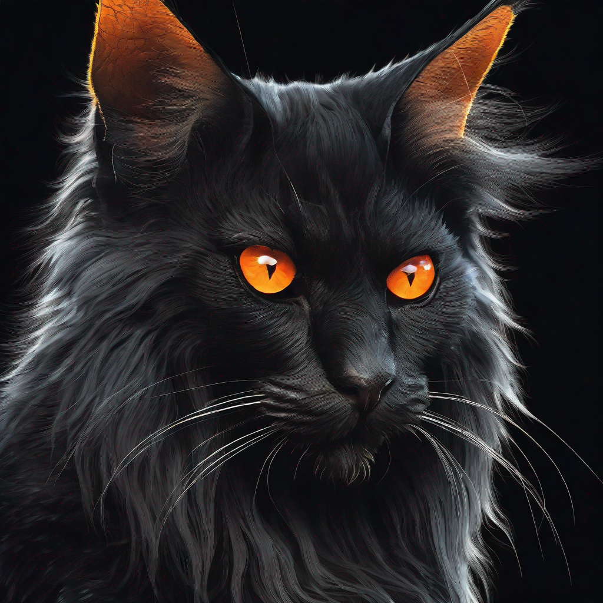

# Cog-SDXL-DeepCache

This is an implementation of Stability AI's [SDXL + DeepCache](https://huggingface.co/docs/diffusers/main/en/optimization/deepcache) as a [Cog](https://github.com/replicate/cog) model.

## Development

Follow the [model pushing guide](https://replicate.com/docs/guides/push-a-model) to push your own fork of SDXL to [Replicate](https://replicate.com).

## Basic Usage

To run a prediction:

    cog predict -i prompt="black fluffy gorgeous dangerous cat animal creature, large orange eyes, big fluffy ears, piercing gaze, full moon, dark ambiance, best quality, extremely detailed"

# Output

